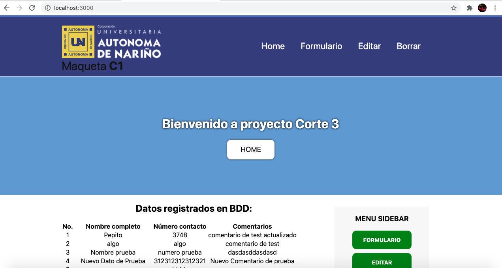
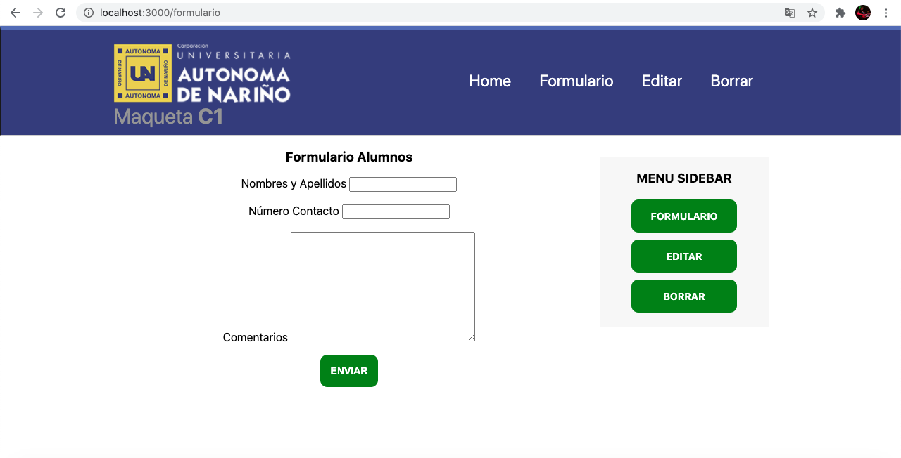
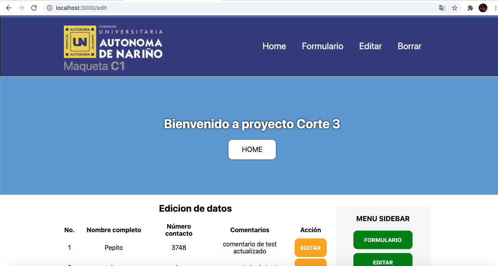
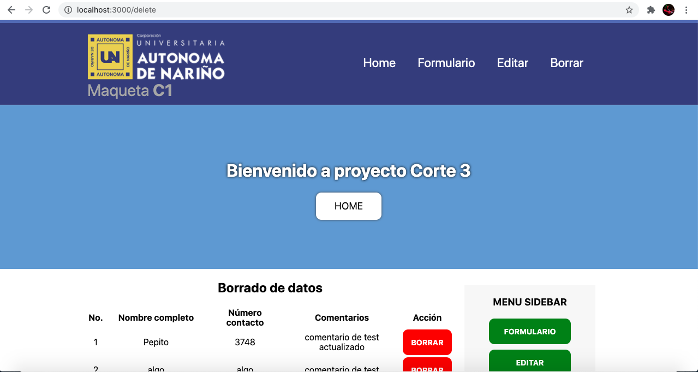

# CRUD MongoDB Cloud NodeJs / Express


## Introducción
Sistema CRUD educacional desarrollado en Node.Js (Express) y CSS como parte de la asignatura Técnicas de Diseño Hipermedia de la Corporación Universitaria Autónoma de Nariño - (AUNAR Villavicencio) para entender el funcionamiento las operaciones básicas (Create Read Update Delete). El sistema está implementado con el paquete de dependencias Express y usa conexión a sistema DBaaS Cloud Atlas de Mongo DB.

### URL de test: https://tecnicashipermedia.herokuapp.com/

### Requisitos para descargar el proyecto (clonar) y usar:
- Tener instalado git (www.git-scm.com)
- Configurar una cuenta de MongoDB Atlas (https://www.mongodb.com/cloud/atlas) y dar de alta un Shared Cluster (Puede ser la opción Free). De esta manera puedes obtener un "connection string" para reemplazar el usado en el código fuente de este repositorio. (línea 34 del server.js)
- Tener instalado node (https://nodejs.org/en/)

### Pasos para clonar:
1. Entrar a algún directorio de tu Sistema Operativo en una ventana terminal (CMD en Windows)
2. ejecutar el comando:```git clone https://github.com/davidmrg/repoPruebaHipermedia.git```

### Pasos para ejecutar:
1. Ingresar al directorio del proyecto (vía consola terminal / CMD)
2. Ejecutar comando```npm install``` para descargar e instalar dependencias
3. Ejecutar comando```node server.js``` para ejecutar proyecto (Si usas nodemon:```nodemon server.js```)
3. Abrir en un navegador: http://localhost:3000


### Pantalla Index:


### Pantalla Formulario de ingreso de datos:


### Pantalla Edición de datos:


### Pantalla Borrado de datos:

